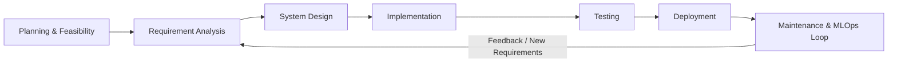
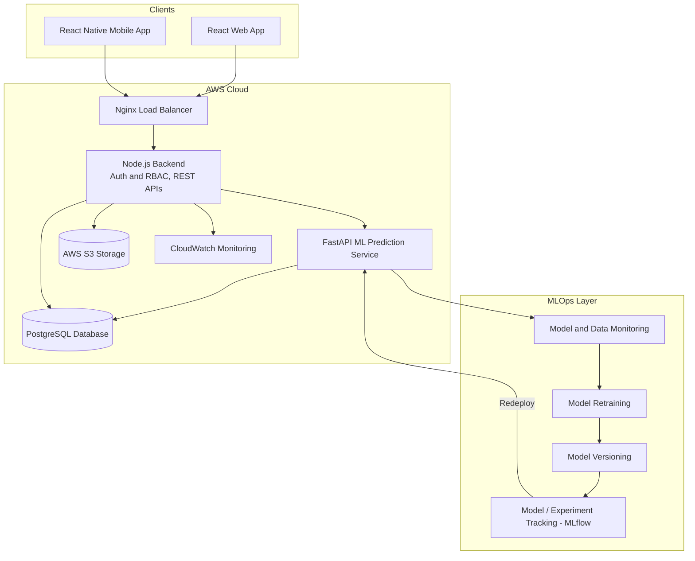
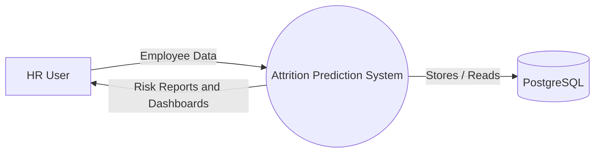
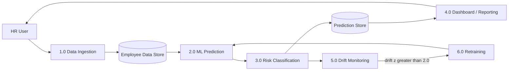
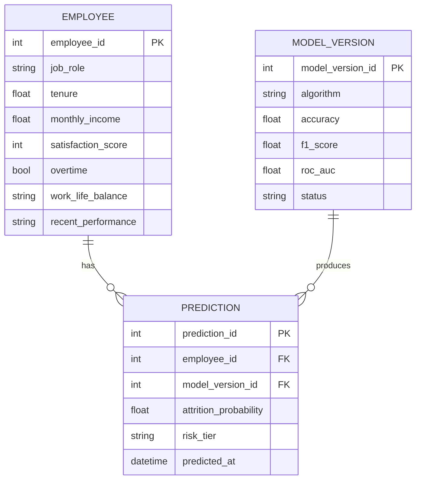
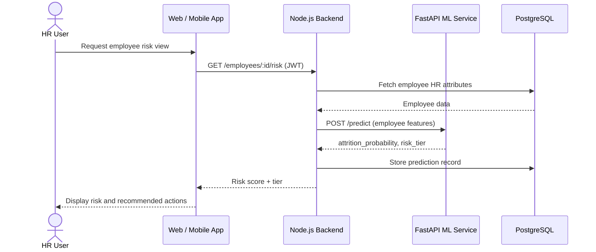
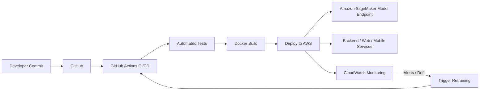

# Product Requirements Document (PRD)
## Employee Attrition Prediction & HR Analytics System with MLOps
### (Structured Across the Full Software Development Life Cycle — SDLC)

| | |
|---|---|
| **Department** | Information Technology, St. Vincent Pallotti College of Engineering and Technology, Nagpur |
| **Academic Year** | 2026–27 |
| **Industry Partner** | IT DAKSH |
| **Industry Mentor** | Ms. Pooja Arora |
| **Project Guide** | Dr. A. Gahankar |
| **Alumni Mentor** | Mr. Karan Masirkar |
| **Team** | Pranav Shende, Mayank Gotmare |

---

## 1. Introduction & Purpose

The **Employee Attrition Prediction & HR Analytics System** is an MLOps-driven platform that helps organizations shift from *reactive* to *proactive* workforce retention. HR teams currently discover attrition only after an employee resigns, because manual analysis cannot keep up with the volume and complexity of HR data. This system continuously analyzes HR attributes, predicts each employee's attrition risk, and surfaces that risk through a web dashboard and mobile app — while an MLOps layer keeps the model itself monitored, versioned, and retrained.

This PRD is organized around the complete **Software Development Life Cycle (SDLC)** — Planning & Feasibility, Requirement Analysis, System Design, Implementation, Testing, Deployment, and Maintenance — so every stage of the project is traceable end to end.

---

## 2. SDLC Model Adopted

**Model chosen: Iterative & Incremental model, run in an Agile-influenced style.**

**Justification:**
- The ML component needs repeated cycles of *train → evaluate → deploy → monitor → retrain*, which fits an iterative model far better than a single-pass Waterfall approach.
- The 2-member team can work on parallel increments (ML/DB/Web vs. Backend/Cloud/Mobile) and integrate them at defined checkpoints.
- Frequent reviews with the Industry Mentor and Guide act as sprint-review-style checkpoints, letting requirements and design be refined between increments.
- Each SDLC phase below is revisited in later increments (e.g., Design and Testing are repeated as the MLOps retraining loop matures), rather than being strictly one-directional.

---

## 3. Phase 1 — Planning & Feasibility Study

### 3.1 Problem Statement
Organizations often struggle to identify employees who are likely to leave before they resign. HR teams have relevant data (job role, income, tenure, satisfaction, overtime, work-life balance) but analyzing it manually is difficult, leading to reactive rather than proactive retention decisions.

### 3.2 Feasibility Analysis

| Feasibility Type | Assessment |
|---|---|
| **Technical** | All required technologies (React, React Native, Node.js, PostgreSQL, Python/Scikit-learn, MLflow, AWS) are mature, well-documented, and within the team's current skill set. |
| **Operational** | HR Managers, Analysts, and Department Managers already work with the underlying data (role, tenure, satisfaction); the system adds a prediction/analytics layer on top rather than replacing existing workflows. |
| **Economic** | Built primarily on open-source tools (React, Node.js, Scikit-learn, MLflow, Docker); AWS costs are the main variable and can start small (S3 + basic compute) and scale with usage. |
| **Schedule** | Scoped to fit an academic-semester timeline (see Section 10), with backend/ML and frontend/mobile work running in parallel to save time. |

### 3.3 Objectives
1. Predict which employees are at higher risk of leaving, with a probability score and risk tier.
2. Give HR a centralized, data-driven view of workforce risk instead of ad-hoc manual review.
3. Operationalize the model with MLOps — versioning, deployment, drift monitoring, automated retraining.
4. Make insights accessible on both web (for analysis) and mobile (for on-the-go access).
5. Deploy the full stack on scalable cloud infrastructure (AWS).

### 3.4 Scope

**In scope:** HR data ingestion & storage, ML training/evaluation, real-time prediction API, risk classification, web dashboard, mobile app, MLOps (tracking, versioning, drift monitoring, retraining), AWS deployment.

**Out of scope (this iteration):** Automated HR actions (the system recommends, HR decides), multi-tenant support for multiple companies, direct integration with external HRMS/payroll systems.

---

## 4. Phase 2 — Requirement Analysis

### 4.1 Requirement Elicitation
Requirements were gathered through: literature survey of 7 recent papers on ML/DL-based attrition prediction, comparative analysis against traditional HR and basic ML approaches, and consultation with the Industry Mentor and Guide.

### 4.2 Stakeholders & Needs

| Role | Primary Needs |
|---|---|
| HR Manager | Identify and analyze high-risk employees; strategic workforce view |
| HR Analyst | Predict attrition risk, generate reports, day-to-day analytics |
| Department Manager | View attrition analytics and high-risk employees for their team |
| System Admin | Manage ML models, monitor model performance, manage access |
| Senior Management | Strategic workforce planning from aggregated risk trends |

### 4.3 Functional Requirements

| ID | Requirement |
|---|---|
| FR-1 | Collect and store employee HR data (role, tenure, income, satisfaction, overtime, work-life balance) in PostgreSQL. |
| FR-2 | Generate an attrition probability and risk score per employee via the ML prediction service. |
| FR-3 | Classify risk into Low (<0.4), Medium (0.4–0.7), and High (>0.7) tiers. |
| FR-4 | Maintain prediction history to track risk changes per employee over time. |
| FR-5 | Web dashboard for HR analytics, risk visualization, and employee-level drill-down. |
| FR-6 | Mobile app for read access to HR insights on the go. |
| FR-7 | Authentication and role-based access control (RBAC) for HR Analyst, Dept Manager, HR Manager, Admin. |
| FR-8 | Track experiments/model versions (MLflow); select and deploy the best-performing model. |
| FR-9 | Monitor live predictions for drift and trigger retraining automatically past a threshold. |
| FR-10 | Generate HR analytics reports. |

### 4.4 Non-Functional Requirements

- **Scalability:** AWS deployment must handle growth in employee records and concurrent HR users.
- **Security:** JWT authentication and RBAC on all APIs.
- **Performance:** Low-latency prediction API for real-time dashboard use.
- **Reliability:** Continuous monitoring (CloudWatch) of application and model health.
- **Maintainability:** Retraining/redeployment automated via MLOps, minimal manual intervention.
- **Usability:** Risk shown as actionable tiers with recommended actions, not raw numbers alone.

---

## 5. Phase 3 — System Design

### 5.1 High-Level Design — Architecture

### 5.2 Data Flow Diagram — Level 0 (Context)

### 5.3 Data Flow Diagram — Level 1

### 5.4 Use Case Summary

| Actor | Key Use Cases |
|---|---|
| HR Analyst | Predict attrition risk, generate reports, view HR dashboard, login |
| Department Manager | View attrition analytics, view high-risk employees, view prediction history |
| HR Manager | View HR dashboard, manage employee data, deploy/update model |
| System Admin | Manage ML models, monitor model performance |

### 5.5 Entity-Relationship (Data) Design

### 5.6 Sequence Diagram — Prediction Request

### 5.7 ML Pipeline Design
Historical HR dataset → clean & encode data → scale & balance classes → feature engineering → model training (XGBoost, Random Forest, Logistic Regression) → evaluation (Accuracy, F1, ROC-AUC) → best-model selection → versioning (MLflow) → deployment as a live inference endpoint.

---

## 6. Phase 4 — Implementation

### 6.1 Technology Stack

| Layer | Technologies |
|---|---|
| Web Frontend | React.js, Tailwind CSS, Chart.js, Redux Toolkit |
| Mobile | React Native, React Navigation, Redux Toolkit |
| Backend | Node.js, Express.js, RESTful APIs, JWT, Multer, Nodemailer |
| Database | PostgreSQL, Prisma ORM, Prisma Migrate, Redis (optional caching) |
| Machine Learning | Python, Pandas, Scikit-learn, MLflow, Joblib |
| DevOps / MLOps | AWS, Docker, GitHub Actions (CI/CD), Amazon SageMaker, Amazon CloudWatch |
| Tools | Postman, VS Code, Trello, Slack, Notion, Ubuntu (Linux) |

### 6.2 Module-wise Implementation & Ownership

| Module | Description | Owner |
|---|---|---|
| Data preprocessing & feature engineering | Cleaning, encoding, scaling, balancing HR data | Mayank |
| Model training & evaluation | XGBoost / Random Forest / Logistic Regression, metrics | Mayank |
| MLOps setup | MLflow tracking, versioning, drift/retraining logic | Mayank (with backend hooks from Pranav) |
| PostgreSQL database design | Employee, Prediction, Model Registry schema | Mayank |
| React web dashboard | HR analytics, risk visualization, drill-down views | Mayank |
| Node.js backend & REST APIs | Auth, RBAC, business logic | Pranav |
| AWS cloud deployment | Infra setup, Nginx, S3, CloudWatch | Pranav |
| React Native mobile app | On-the-go HR insights, API integration | Pranav |

### 6.3 Coding Standards
- Consistent linting/formatting across JS (ESLint/Prettier) and Python (PEP 8).
- API contracts agreed upfront between backend and ML service to avoid integration drift.
- Version control via Git/GitHub with feature branches, merged through pull requests.

---

## 7. Phase 5 — Testing

### 7.1 Testing Levels

| Level | Focus | Example |
|---|---|---|
| Unit Testing | Individual functions/components | Prediction function returns a probability in [0, 1]; risk-tier classifier maps scores correctly |
| Integration Testing | Interfaces between modules | Backend correctly calls the FastAPI prediction endpoint and stores the response |
| System Testing | End-to-end flow | Login → view dashboard → view employee risk → generate report |
| User Acceptance Testing (UAT) | Real-world usability | Industry Mentor/Guide validate that risk tiers and recommended actions are meaningful to HR |
| ML Model Validation | Model correctness | Cross-validation; confirm Accuracy/F1/ROC-AUC meet agreed thresholds before deployment |
| Performance Testing | Latency under load | Prediction API response time under concurrent requests (Postman/load test) |
| Security Testing | Access control | Verify JWT-protected routes reject unauthorized/role-mismatched requests |

### 7.2 Sample Test Cases

| ID | Test Case | Expected Result |
|---|---|---|
| TC-01 | Submit valid employee data to /predict | Returns probability (0–1) and correct risk tier |
| TC-02 | Access HR dashboard without login | Request rejected (401 Unauthorized) |
| TC-03 | Department Manager attempts to deploy/update model | Access denied (role restriction) |
| TC-04 | Simulate prediction drift above z = 2.0 | Retraining pipeline is triggered automatically |
| TC-05 | View prediction history for an employee | Historical risk scores returned in chronological order |

---

## 8. Phase 6 — Deployment

### 8.1 CI/CD & Release Pipeline

### 8.2 Deployment Flow
User → React Web/Native App → Nginx (Load Balancer) → Node.js Backend → FastAPI ML Prediction Service → PostgreSQL Database → AWS S3 (storage) → CloudWatch (monitoring).

### 8.3 Rollout Plan
1. Deploy backend, database, and ML service to a staging AWS environment.
2. Run system testing and UAT in staging.
3. Promote to production once test cases (Section 7.2) pass and mentor/guide sign off.
4. Enable CloudWatch monitoring and the drift-based retraining trigger from day one in production.

---

## 9. Phase 7 — Maintenance & MLOps Operations

- **Monitoring:** CloudWatch tracks application health; live predictions are monitored for drift.
- **Automated retraining:** A drift z-score > 2.0 triggers retraining automatically; z ≤ 2.0 simply stores the prediction and continues normal operation.
- **Versioning & rollback:** MLflow keeps every model version, so a newly retrained model can be rolled back if it underperforms.
- **Bug fixes & support:** Standard issue-tracking via GitHub/Trello for backend, frontend, and mobile defects found post-deployment.
- **Continuous improvement:** Periodic review of model metrics (Accuracy, F1, ROC-AUC) against the original evaluation baseline to catch slow degradation that drift-monitoring alone might miss.

---

## 10. Risk Management

| Risk | Phase Affected | Mitigation |
|---|---|---|
| Imbalanced HR dataset skews the model | Design / Implementation | Class-balancing during preprocessing; monitor F1/ROC-AUC, not just accuracy |
| Model drift as real HR patterns change | Maintenance | Automated drift monitoring with a defined retraining trigger |
| Backend/ML/frontend integration delays (2-person team) | Implementation | Clear module ownership (Section 6.2) and early API-contract agreement |
| AWS cost/complexity | Deployment | Start with minimal viable services (S3 + basic compute), scale only as needed |
| Insufficient test coverage before release | Testing | Defined test levels and sample test cases (Section 7) executed before promotion to production |

---

## 11. Project Management

### 11.1 Team & Contribution Mapping

| Member | Focus Areas | Contributions |
|---|---|---|
| **Pranav Shende** | Backend, Cloud, Mobile App | Node.js backend & REST APIs; AWS cloud deployment & configuration; React Native mobile app and its API integration; authentication and application-level functionality |
| **Mayank Gotmare** | Machine Learning, Frontend, Database, Analytics | ML pipeline (preprocessing, feature engineering, model training/evaluation); React web frontend & HR analytics dashboard; PostgreSQL database design; ML-to-application integration and data visualization |

### 11.2 Success Metrics / KPIs
- Model evaluation metrics (Accuracy, F1, ROC-AUC) meet an agreed threshold on held-out data.
- Dashboard correctly surfaces high-risk employees with actionable detail.
- Near real-time latency from data update to updated risk score.
- Drift-triggered retraining loop functions without manual intervention in test simulation.

---

## 12. Indicative SDLC Timeline

| SDLC Phase | Suggested Duration |
|---|---|
| 1. Planning & Feasibility Study | Weeks 1–2 |
| 2. Requirement Analysis | Weeks 2–3 |
| 3. System Design | Weeks 3–5 |
| 4. Implementation (ML + Backend + DB) | Weeks 5–8 |
| 4. Implementation (Web + Mobile) | Weeks 8–10 (parallel where possible) |
| 5. Testing | Weeks 10–11 |
| 6. Deployment | Weeks 11–12 |
| 7. Maintenance & MLOps loop validation | Week 12–13 |
| Documentation & Final Presentation | Week 13 |

*(Durations are a suggested planning guide — adjust to your actual semester calendar.)*

---

## 13. Appendix

### A. Literature Survey (Summary)

| # | Paper | Author(s) | Year | Key Finding |
|---|---|---|---|---|
| 1 | Predicting Employee Attrition Using Machine Learning | G. M. Alharbi et al. | 2025 | Evaluates ensemble ML algorithms for attrition/workforce-risk prediction |
| 2 | Employee Attrition Prediction using Machine Learning | R. Veeramani et al. | 2025 | Applies ML to demographic and workplace characteristics |
| 3 | Employee Turnover Prediction Model Based on Feature Engineering and ML | Y. Fang et al. | 2025 | Kaggle HR dataset with full ML pipeline, emphasis on feature engineering |
| 4 | Employee Turnover Prediction: Enhancing Workforce ... | S. Kasana et al. | 2025 | Identifies key influencing factors for data-driven retention |
| 5 | Comparative Analysis of Deep Learning Models for ... | S. Sagar et al. | 2025 | Deep learning + Explainable AI for attrition prediction |
| 6 | Deep Learning-Based Employee Skills Inventory and ... | L. Suddapally et al. | 2025 | Deep-learning approach to attrition behavior prediction |
| 7 | Harnessing SERM: Deep Neural Networks for Strategic Employee Retention | K. Kabilan et al. | 2024 | Strategic retention model using deep learning |

### B. Comparative Analysis (Summary)
The proposed system was benchmarked against Traditional HR (manual), a Basic ML Model, and a generic HR Analytics System across: attrition prediction method, web & mobile access, MLOps & monitoring, cloud deployment, risk score classification, prediction history/analytics, and automated model updates. The proposed system is the only one offering full coverage across all seven dimensions.
