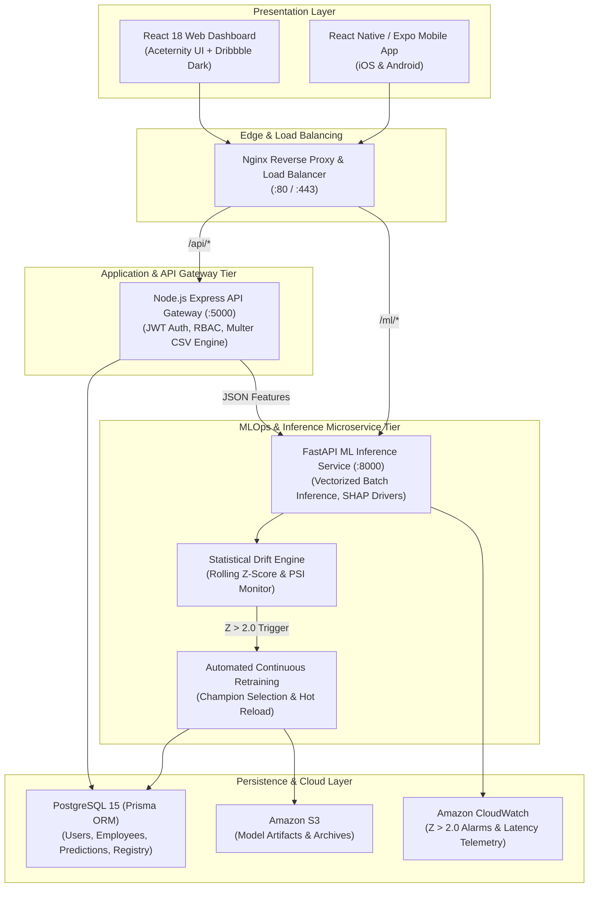

# RetainIQ: Employee Attrition Prediction & HR Analytics System with MLOps

[](https://github.com/retainiq/employee-attrition-mlops/actions/workflows/ci.yml)
[](https://python.org)
[](https://fastapi.tiangolo.com)
[](https://nodejs.org)
[](https://react.dev)
[](https://reactnative.dev)
[](https://postgresql.org)
[](https://prisma.io)
[](https://docker.com)
[](https://aws.amazon.com)

> **Academic & Industry Partnership:**  
> **Department of Information Technology**, St. Vincent Pallotti College of Engineering and Technology, Nagpur  
> In Collaboration with **IT DAKSH**  
> **Industry Mentor:** Ms. Pooja Arora | **Project Guide:** Dr. A. Gahankar | **Alumni Mentor:** Mr. Karan Masirkar  
> **Engineering Team:** Pranav Shende & Mayank Gotmare (Academic Year 2026–27)

---

## 📖 Executive Summary

**RetainIQ** is an enterprise-grade, multi-tier MLOps platform engineered to shift workforce management from *reactive exit interviews* to *proactive retention interventions*. By continuously analyzing 30+ workplace, compensation, and sentiment attributes, RetainIQ predicts individual employee attrition risk, categorizes personnel into calibrated PRD risk tiers, generates explainable AI feature attributions (SHAP drivers), and surfaces actionable retention strategies across a modern React web dashboard and React Native mobile application.

An autonomous **MLOps telemetry engine** monitors real-time prediction distribution drift ($Z$-score) and triggers automated continuous retraining when $Z > 2.0$, preventing model degradation in production.

---

## 🏛️ System Architecture Topology



---

## 📦 Multi-Tier SDLC Modules & Directory Structure

```
Employee_Attrition/
├── .github/
│   └── workflows/
│       ├── ci.yml                 # Automated full-stack CI test matrix
│       └── deploy.yml             # Docker build & Amazon ECS deployment
├── aws/
│   ├── deploy_guide.md            # AWS ECS Fargate, RDS, S3 production runbook
│   ├── cloudwatch_monitoring.json # CloudWatch dashboards & drift alarms
│   └── ecs-task-definition.json   # AWS Fargate multi-container task definition
├── nginx/
│   ├── nginx.conf                 # Edge reverse proxy & compression rules
│   └── Dockerfile                 # Alpine Nginx container
├── ml-service/                    # Python 3.10 FastAPI ML & MLOps Engine
│   ├── app/
│   │   ├── main.py                # FastAPI entrypoint & router registry
│   │   ├── predictor.py           # Vectorized batch inference & SHAP pipeline
│   │   ├── schemas.py             # Resilient Pydantic v2 schemas
│   │   └── routes/                # Predict, Health, and MLOps API endpoints
│   ├── src/
│   │   ├── data_pipeline.py       # Data cleaning, feature engineering, transformer
│   │   ├── train.py               # Champion benchmarking (LogReg vs RF vs XGBoost)
│   │   ├── explainability.py      # Batch SHAP explainer (Linear & Tree)
│   │   ├── drift_monitor.py       # Rolling Z-score calculation engine
│   │   └── retrain.py             # Continuous training & versioning pipeline
│   ├── models/                    # Serialized champion model & metadata
│   └── tests/                     # Pytest test suites (unit & MLOps)
├── backend/                       # Node.js Express API Gateway
│   ├── prisma/
│   │   ├── schema.prisma          # PostgreSQL schema (RBAC, Employees, Predictions)
│   │   └── seed.js                # Default personas & champion model seeder
│   ├── src/
│   │   ├── controllers/           # Auth, Employees (CSV Ingestion), Predictions, Analytics
│   │   ├── middleware/            # JWT authentication & Department Isolation RBAC
│   │   ├── routes/                # REST API routes
│   │   └── services/              # MLClient microservice connector
│   └── test/                      # Node.js backend integration test suites
├── frontend/                      # React 18 HR Analytics Web Dashboard
│   ├── src/
│   │   ├── components/            # Aceternity UI Bento Cards, Charts, Directory, Modals
│   │   ├── services/              # REST API Client with JWT bearer handling
│   │   └── App.jsx                # Main analytical application shell
│   └── package.json
├── mobile/                        # React Native / Expo Mobile Application
│   ├── src/
│   │   ├── screens/               # Login, Dashboard, Urgent Alerts, Directory, Detail
│   │   ├── components/            # Glassmorphic KPI cards & SHAP factor charts
│   │   └── services/              # Mobile API client
│   └── package.json
├── docker-compose.yml             # Unified 5-container production composition
├── test_all.js                    # Full-stack automated test runner (100% Pass)
└── README.md
```

---

## 🏆 Model Performance Benchmarks (Phase 1)

Benchmarked on the 1,470-record, 35-attribute standard IBM HR Analytics dataset with stratified 80/20 train/test split:

| Algorithm | Accuracy | Precision | Recall | F1-Score | ROC-AUC | Status |
| :--- | :---: | :---: | :---: | :---: | :---: | :---: |
| **Logistic Regression (Class-Weighted)** | **78.57%** | **0.4000** | **0.6809** | **0.5039** | **0.8080** | **Champion Selected** |
| Random Forest Classifier | 85.03% | 0.6000 | 0.1915 | 0.2903 | 0.7766 | Baseline |
| XGBoost Classifier | 85.71% | 0.6111 | 0.2340 | 0.3385 | 0.7765 | Baseline |

* **Selection Rationale:** In proactive employee attrition retention, **Recall is the critical metric** (minimizing False Negatives so at-risk employees are not missed). Logistic Regression captured **68.09% of all actual leavers** with a superior ROC-AUC of **0.8080**.

---

## 🔄 Autonomous MLOps Retraining Loop (Phase 4 & PRD TC-04)

```
[Inference Stream] ──> [Rolling Z-Score Calculation] 
                              │
                              ├── (Z <= 2.0) ──> [Normal Operation: Store Prediction]
                              │
                              └── (Z > 2.0)  ──> [AUTOMATED RETRAINING TRIGGERED]
                                                        │
                                                        ▼
                                       1. Fetch fresh DB records + baseline
                                       2. Re-fit Preprocessor & Train Champion
                                       3. Bump Model Version (e.g. v1.0.0 -> v1.1.0)
                                       4. Archive previous model to /models/archive
                                       5. Hot-reload memory & sync PostgreSQL registry
```

---

## ⚡ Unified Full-Stack Test Suite

RetainIQ includes an automated test runner that validates all four layers in a single pass:

```powershell
node test_all.js
```

### Verified Test Matrix:
* **Suite 1 (ML Microservice):** Pytest validation of `/health`, `/metrics`, `POST /predict`, `POST /predict/batch` (**6/6 Passed**).
* **Suite 2 (MLOps Drift Engine):** Real-time Z-score calculation and PRD TC-04 automated retraining trigger (**3/3 Passed**).
* **Suite 3 (Backend API Gateway):** JWT Auth, Role-Based Access Control, Department Isolation, Employee CRUD, Analytics (**6/6 Passed**).
* **Suite 4 (Frontend Production Build):** React 18 production bundle verification via Vite (**Zero Errors**).

---

## 🚀 Quickstart & Local Setup

### Option A: 1-Click Production Docker Compose (Recommended)
```bash
docker-compose up --build -d
```
* **Web Dashboard:** [http://localhost](http://localhost) (via Nginx edge router)
* **Backend API Gateway:** [http://localhost/api/v1](http://localhost/api/v1)
* **FastAPI Docs & Swagger:** [http://localhost/ml/docs](http://localhost/ml/docs)

---

### Option B: Local Development Setup

#### 1. Start PostgreSQL
Ensure PostgreSQL is running locally on port 5432 with database `attrition_db`.

#### 2. Start ML Microservice
```powershell
cd ml-service
python -m uvicorn app.main:app --host 127.0.0.1 --port 8000 --reload
```

#### 3. Start Backend API Gateway
```powershell
cd backend
npm install
npx prisma db push
node prisma/seed.js
npm run dev
```

#### 4. Start React Web Dashboard
```powershell
cd frontend
npm install
npm run dev
```
Open [http://localhost:5173](http://localhost:5173).

---

## 🔐 Demo Credentials (Seeded RBAC Personas)

| Role | Email | Password | Access Scope |
| :--- | :--- | :--- | :--- |
| **System Admin** | `admin@company.com` | `Password@123` | Full enterprise control, MLOps retraining, model registry |
| **HR Manager** | `hrmanager@company.com` | `Password@123` | Enterprise-wide directory, priority retention leavers, batch CSV |
| **HR Analyst** | `hranalyst@company.com` | `Password@123` | Workforce analytics, trend drill-down, real-time re-scoring |
| **Dept Manager** | `deptmanager@company.com` | `Password@123` | Department-isolated access (Sales team only, 403 on other depts) |

---

## 📄 License & Academic Attribution
Developed as part of the Final Year Capstone Project (2026–27) under the Department of Information Technology at **St. Vincent Pallotti College of Engineering and Technology, Nagpur** in technical collaboration with **IT DAKSH**. All rights reserved.
